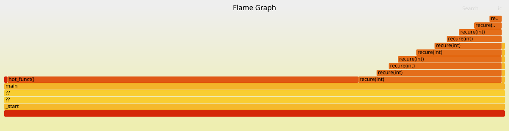

# cpp-sampling-profiler

A CPU sampling profiler for Linux/x86-64. Interrupts a running program 100
times per second, captures the call stack at each interrupt, and emits
folded-stack output that renders as a flamegraph.



## Build

```bash
g++ -O1 -g -fno-omit-frame-pointer -no-pie -o profiler main.cpp workload.cpp
```

All four flags are required:

| Flag | Why |
|---|---|
| `-g` | keeps the symbol table so addresses resolve to names |
| `-fno-omit-frame-pointer` | preserves the `rbp` chain the unwinder walks |
| `-no-pie` | disables position-independent loading so runtime addresses match the binary on disk |
| `-O1` | light optimization; `-O2` inlines the workload functions and collapses the stacks |

## Run

```bash
./profiler > stacks.txt
perl FlameGraph/flamegraph.pl stacks.txt > profile.svg
```

FlameGraph: https://github.com/brendangregg/FlameGraph

Output is one line per distinct stack:

```
_start;??;??;main;hot_funct() 113
```

## How it works

<!-- Write each of these in your own words, 2–4 sentences. -->

**Sampling** — why a profiler samples instead of instrumenting, and what
that means for what it can and can't see.

**The timer** — what `setitimer` does, and why `ITIMER_PROF` rather than
`ITIMER_REAL`.

**The signal handler** — what the kernel hands you in `context`, and why
the handler's own registers are useless for this.

**Stack unwinding** — the frame pointer chain: what's at `rbp+0`, what's
at `rbp+8`, and why that forms a walkable list.

**Why RIP is captured separately** — the walk yields return addresses, so
the currently-executing function never appears in it. Where that address
comes from instead.

**Symbolization** — why address→name resolution happens after the run and
not inside the handler.

## Signal safety

The handler touches only pre-allocated globals and a `volatile
sig_atomic_t`. No allocation, no locks, no stdio — all of which are
unsafe in a handler, since the interrupted code may hold an allocator or
stdio lock at the moment of interruption.

## Limitations

- **Fixed-size sample buffer.** Samples are written to a static array
  (4096 samples × 64 frames). Once full, further samples are dropped. The
  correct approach is a lock-free SPSC ring buffer drained by a separate
  thread; not implemented.
- **Requires `-no-pie`.** With PIE, runtime addresses are offset by a
  random load base and won't resolve against the binary. Handling it means
  parsing `/proc/self/maps` for the base and subtracting it.
- **Library frames show as `??`.** `addr2line` is invoked against the main
  binary only, so addresses inside libc don't resolve. Fixing it requires
  per-module lookup, again via `/proc/self/maps`.
- **Requires frame pointers.** Production binaries usually omit them;
  correct unwinding there means DWARF CFI.
- **Single-threaded.** `SIGPROF` is delivered to one thread.
- **Fixed 100 Hz.** A sampling rate that divides evenly into a program's own
  periodicity can sample the same phase repeatedly and skew the result;
  real profilers use 99 Hz for this reason.

## Validation

`hot_funct` performs 100× the work of `cold_funct`. The profiler
attributes [X]% of samples to it, matching the ratio predicted from the
source before measuring.
